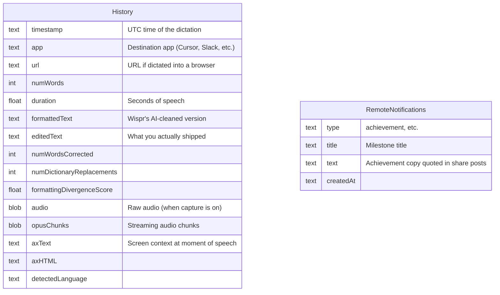
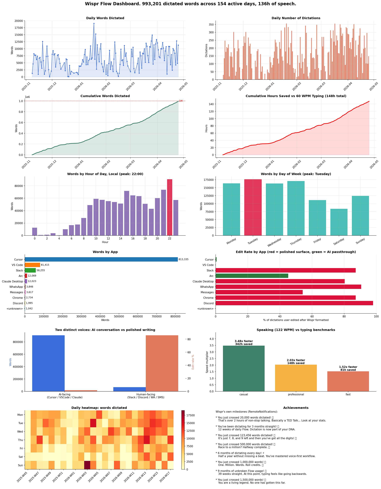

# Wispr Flow Analysis

Built by [Chip Rarau (@crarau)](https://github.com/crarau). Open source under [Ideaplaces](https://ideaplaces.com).

Analytics toolkit for [Wispr Flow](https://wisprflow.ai) voice dictation. Pulls your full local corpus, surfaces the patterns the in-app dashboard does not show (per-app split, edit rates, your two distinct voices), and drafts a share-ready summary in your voice using Azure OpenAI or Anthropic.

This is what happens when you give a power user a year of dictations and a SQLite file. Wispr Flow stores the destination app, the AI-formatted text, the user-edited text, and a stream of milestone notifications, and that is enough to compute insights worth posting about. A few hundred lines of Python plus one LLM call produces a dashboard, an analytics JSON, and four ready-to-paste post variants.

## Local-first by design

Wispr Flow keeps everything on your computer. Every dictation, every transcript, and the audio recordings themselves (for the fraction of dictations where capture is on) live in a single SQLite file:

- macOS: `~/Library/Application Support/Wispr Flow/flow.sqlite`
- Windows: `%APPDATA%\Wispr Flow\flow.sqlite`

This toolkit opens that file in read-only mode, computes the rollups, writes the results to `outputs/` on the same machine, and stops. **Nothing is uploaded. No telemetry. No analytics service. No phone home.** That is the whole point of open-sourcing this: you can read every line of code that touches your data before you run it.

The only outbound network call is the optional LLM step that turns your aggregate numbers into a draft post. That call sends only rolled-up numbers (counts, averages, edit rates, achievement quotes), never raw dictation text or audio. Skip the AI step and the toolkit is fully offline.

### What's in the file



`History` is the main rollup source. `RemoteNotifications` provides the quotable achievement hooks ("You are a living legend. No one has gotten this far."). The `Dictionary` and `Polish` tables also live in the same file and are surfaced in `outputs/analytics.json` for downstream use.

## What you get

A single dashboard PNG and a JSON file with everything underneath, plus four LLM-generated post variants ready to paste into LinkedIn or X.

The four insights that matter:

1. **Total volume.** Words, hours, active days, longest streak, peak day.
2. **Speed and time saved.** Speaking WPM vs casual / professional / fast typing benchmarks. Cumulative hours saved.
3. **Two voices.** AI-facing dictation (Cursor, VS Code, Claude Desktop) vs human-facing dictation (Slack, Discord, WhatsApp, Messages). Different speeds, different edit rates, different roles. This split is only visible because Wispr Flow stores the destination app for every dictation.
4. **Wispr's own achievements.** Your `RemoteNotifications` table is full of milestone quotes ("9 months of unbroken Flow usage", "1,500,000 words crossed", and the rest). The AI summary script quotes these verbatim, which is the most viral hook in the corpus.

## Quick start

```bash
git clone <this repo>
cd wispr-flow-analysis
python3 -m venv .venv && source .venv/bin/activate
pip install -r requirements.txt
cp .env.example .env  # then edit with your Azure OpenAI or Anthropic key

python scripts/snapshot.py     # safe read-only copy of flow.sqlite
python scripts/analytics.py    # rollup -> outputs/analytics.json
python scripts/visualize.py    # -> outputs/dashboard.png
python scripts/ai_summary.py   # -> outputs/share_*.md
```

Full setup details in [SETUP.md](SETUP.md). Configuration reference in [CONFIG_EXAMPLE.md](CONFIG_EXAMPLE.md).

## Example output

See [EXAMPLE.md](EXAMPLE.md) for the maintainer's actual run: 26,577 dictations, 993,201 words, 135.8 hours, the two-voices split (1.7% edit rate to AI vs 85.9% to humans), and the eight Wispr-emitted achievement notifications quoted verbatim. Your numbers will be different.



### Sample share post (real numbers from the maintainer's run)

This is what the `single_stat_hook` variant produced from the data above. Generated by the script, not hand-written. Pasted unedited.

> "You are a living legend. No one has gotten this far."
>
> Wispr Flow popped that notification on my screen the moment I crossed 1,500,000 dictated words. A backend somewhere had been counting, and decided to say something about it.
>
> Here is what the line looks like underneath. 26,577 dictations. 993,201 words. 135.8 hours of speech across 154 active days. Average speaking speed 122 WPM. Longest unbroken streak: 48 days.
>
> The interesting part is not the speed. It is that I now have two distinct voices.
>
> Voice one is the AI-conversation voice. Cursor, VS Code, Claude Desktop. 20,356 dictations, 906,773 words, 128 WPM. Edit rate of 1.7%. I almost never go back. I think out loud, the model catches it, the work moves.
>
> Voice two is the human-conversation voice. Slack, Discord, WhatsApp, Messages. 4,701 dictations, 68,705 words, 99 WPM. Edit rate of 85.9%. Almost everything I send to a person gets a second pass. Slower, more careful, more polished.
>
> That gap is the actual story. Voice-first does not just replace typing. It reshapes how I sound depending on who is on the other end.
>
> If you have not tried voice-first yet, the unlock is not WPM. It is the freedom to keep moving while you think.

The script generates four variants per run. Two more are checked in:

- [`examples/share_post.md`](examples/share_post.md), LinkedIn-format data-heavy draft
- [`examples/share_thread.md`](examples/share_thread.md), numbered Twitter/X thread

The fourth variant (`narrative_heavy`) generates when you run the script. Pick whichever variant matches the surface and the day.

## Why Wispr Flow's schema unlocks this

Most dictation tools store flat text and a timestamp. Wispr Flow stores the full picture, and this script is what falls out of that. `app` plus `formattedText` vs `editedText` together tell you exactly how your style changes depending on who is on the other end. That is the two-voices analysis. `RemoteNotifications` makes the quotable achievement hooks possible.

The toolkit reads `app`, `formattedText` vs `editedText` (for the edit-rate split), `numWords`, `duration`, `timestamp`, `detectedLanguage`, plus `RemoteNotifications` for the achievement quotes. The richer columns (`axText`, `audio`, etc.) are surfaced in `outputs/analytics.json` for downstream use.

## How the two-voices analysis works

Apps in `config.AI_FACING_APPS` (Cursor, VS Code, Claude Desktop) almost never get edited after Wispr formats them. Apps in `config.HUMAN_FACING_APPS` (Slack, Discord, WhatsApp, Messages) almost always do. The script reports both blocks separately, with their own word counts, WPM, edit rates, and time-saved figures. Adjust the two sets in `config.py` to match how you actually use Wispr.

## License

MIT. See [LICENSE](LICENSE).

## Credits

Built by [Chip Rarau (@crarau)](https://github.com/crarau), a Wispr Flow power user. Not affiliated with Wispr Flow. Released under [Ideaplaces](https://ideaplaces.com) so anyone running Wispr Flow can point it at their own `flow.sqlite` and see the same kind of breakdown.
